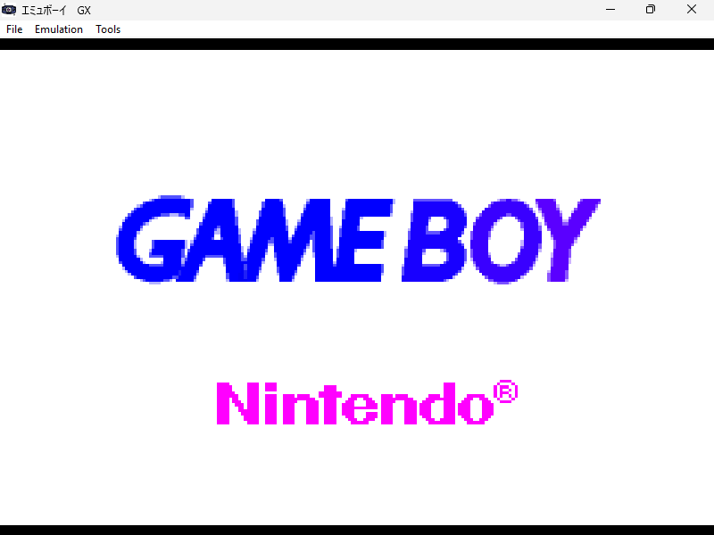
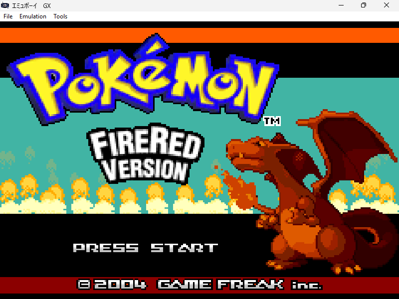
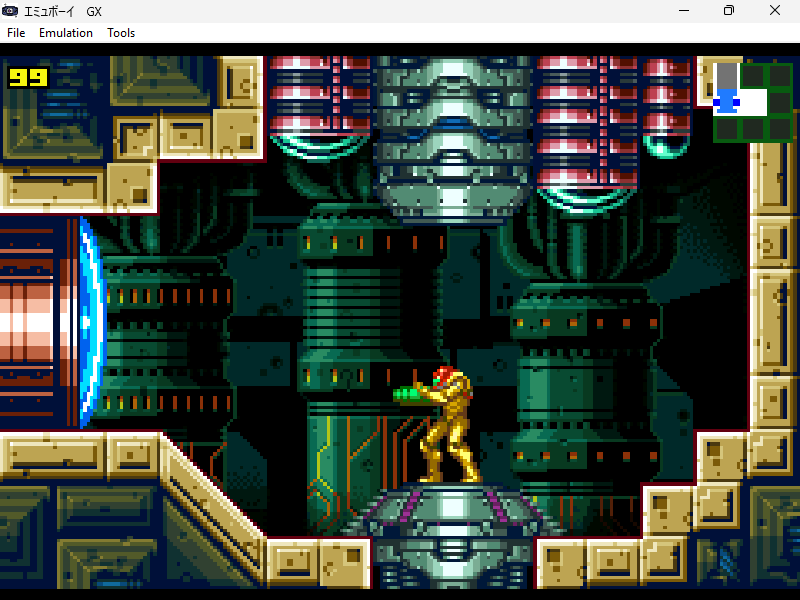
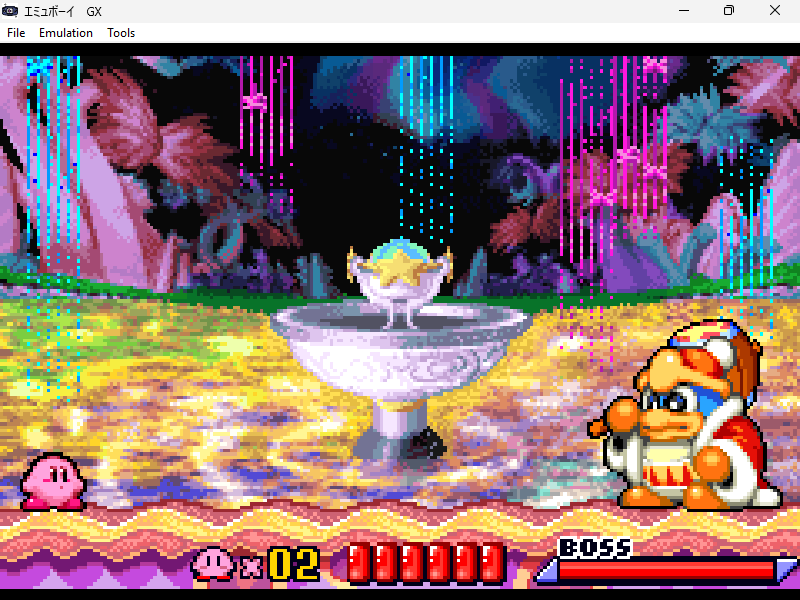

# EmuBoy GX (エミュボイGX)

## How to use

As first thing, put a valid gba bios into ```data/gba_bios.bin```. After that launch the emulator from command line using:
```emuboyGX.exe <rom path>```
Optionally, you can drag and drop the rom file to the executable.

## Controls

| PC | GAMEBOY ADVANCE |
|----|-----------------|
| ARROW KEYS | DPAD |
| Z | B |
| X | A |
| A | L |
| S | R |
| RIGHT SHIFT | SELECT |
| RETURN | START |

The emulator also supports controller's input.

## Hardware features

- [x] Proper ARM7TDMI timings, with pipeline emulation 
- [x] Proper Prefetcher timings
- [ ] Proper Dma timings (This can cause issues with VERY few games)
- [ ] Mosaic mode
- [x] SRAM, FLASH, EEPROM save types supported

## Additional features

- [x] Savestates and Loadstates (with embedded screenshot)
- [x] Audio Recording
- [x] Screenshots
- [x] Loading *.gba from a *.zip file
- [ ] HLE bios emulation. At the moment you need to used a valid gba bios.
- [x] Turbo Mode
- [x] Minimal Cheat Engine Embedded 
- [x] FullScreen by double clicking the window

## Demo

You can try a demo [here](https://yughias.github.io/pages/emuboyGX/emulator.html)

## Screenshots

|  |  |
|--|--|
|  |  |
